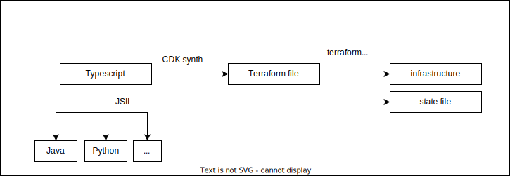

# Functions na OCI

## Instalação de function no OCI


### 010 Instalação do compartment

```bash
git checkout -f step1
```

### 020 Instalação do registry (docker registry)

```bash
git checkout -f step2
```

### 030 Upload da imagem docker

```bash
git checkout -f step3
```

### 040 Criação da rede VCN

```bash
git checkout -f step4
```

### 050 Function

```bash
git checkout -f step5
```

### 060 Api Gateway

```bash
git checkout -f step6
```




### 010 Instalação do compartment using CDK

```bash
git checkout -f cstep1
```

### 020 Instalação do registry (docker registry) using CDK

```bash
git checkout -f cstep2
```

### 030 Upload da imagem docker using CDK

```bash
git checkout -f cstep3
```

### 040 Criação da rede VCN using CDK

```bash
git checkout -f cstep4 
```

### 050 Function using CDK

```bash
git checkout -f cstep5
```

### 060 Api Gateway using CDK

```bash
git checkout -f cstep6
```

### bonus test cdk

```bash
git checkout -f bonus
```

